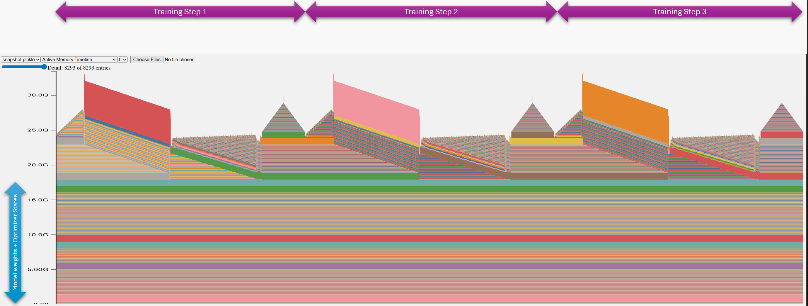
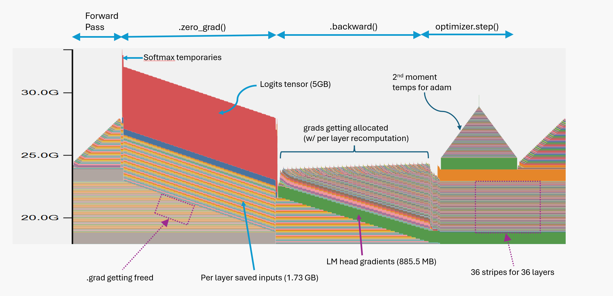
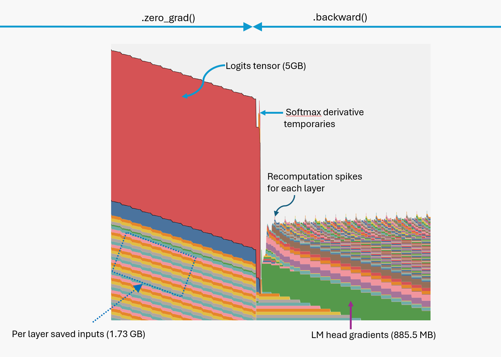
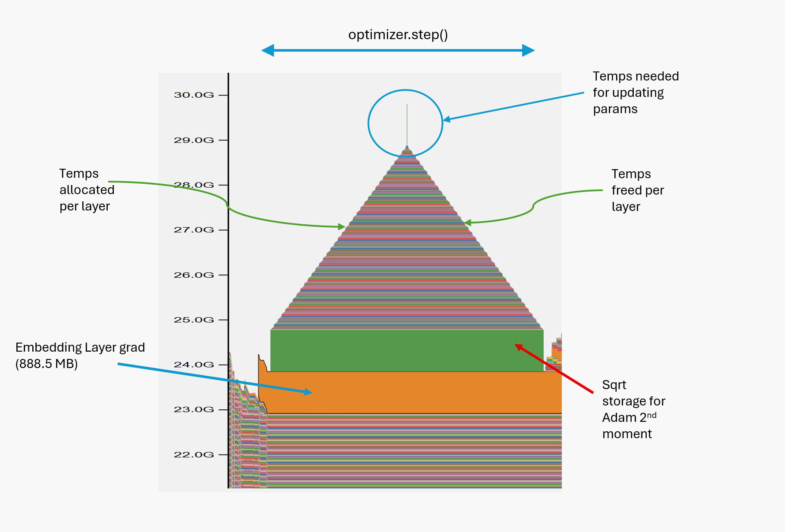

The `torch.OutOfMemoryError` is one of the most dreaded errors where many folks descend into making guesses until something works. A much better, faster, and disciplined approach is to profile memory utilization. Like radiologists, developing intuition about profile images can immensely help you find anomalies and mistakes in training or inferencing code. Especially in the age of RL, where tight memory management is critical, memory profiling skills are extremely valuable.

## Getting Memory Profile Data

To keep things simple, I (well, mostly Claude) have created a [standalone Python module](https://github.com/sytelus/nanugpt/blob/main/nanugpt/acc_mem_profiler.py) that you can drop into any project and start profiling with just a few lines of code:

```python
  with AccMemProfiler() as prof:
      for _ in range(3):
          training_step(model, optimizer, input_ids, labels)

  prof.save_html('path/to/profile.html')
```

Open the saved `profile.html` to see the profile results. To follow along with this tutorial, you can use the [code example](https://github.com/sytelus/nanugpt/blob/b33d17c96f045eb60318209dcb4b520d5cbe5be3/scripts/profiling/model_memory.py) that profiles a Qwen 2.5 1.5B model-type architecture for 3 training steps. I also threw in activation checkpointing just for fun. To run this code on GPUs with < 48GB RAM, reduce batch size as needed.

## Interpreting Memory Profile Data

There are strange shapes in `profile.html`, but we can already see 3 repeating patterns corresponding to 3 training steps:



Each color in the profile is selected using a hash of the call stack. The alternating layers of colors indicate memory operations happening layer by layer. An increasing slope with stripes means layers are allocating something one after another, while a decreasing slope means they are freeing something in sequence.

You can move your cursor over each color to see the corresponding call stack. An important thing to remember is that the memory operation happened during that call, not where your cursor is positioned. You may typically see forward, backward, or zero_grad calls on the call stack. You may even see a forward call in the backward call stack due to activation checkpointing. One tip is that frontier LLMs are good at interpreting these call stacks about 50% of the time :smiley:.

Notice that there is a fixed band at the bottom that stays constant throughout the entire step. These are the allocations for model parameters and optimizer states. In our case, model parameters are 6GB, and the Adam optimizer has 2 states for each parameter, adding another 12GB. So the fixed memory is about 18GB, which checks out.

## Phases in a Training Step

Let's take the first training step and break it down.



First, notice the many stripes in various places. Each stripe corresponds to memory operations in a layer. Multiple stacked stripes indicate something happening layer by layer.

### Forward Pass

When we execute the forward pass, each layer saves its input because we are using activation checkpointing. Later, these inputs will be used to recompute activations during the backward pass. This is what the rising stripes in the first half of the profile represent.

The critical part of the forward pass from a memory perspective is what happens in the final layer where we compute the logits. Due to the large vocab size (151k), logits are huge, and you can see their relative size in memory compared to everything else.

### Zeroing Grads

After loss computation, we call `optimizer.zero_grad()`. Notice that at this point, the logits tensor has gone out of Python scope, but miraculously it's still alive! This is because autograd holds a reference to it in the computational graph since we still need to do backprop. During `zero_grad()`, memory consumption does go down as the previous `.grad` values get freed up layer by layer, causing the downward slope in the stripes beneath the red logits block.

### Backward Pass

When the `.backward()` call starts, we see a spike at the end of the red parallelogram.



This big spike is immediately followed by a straight cliff. The spike occurs because significant memory is needed for computing the softmax during the cross-entropy gradient calculation. Once this is done, we no longer need the logits, so they get freed, forming the straight cliff down.

Then we go through each layer performing the backward pass. Notice there is a tiny spike at each layer, forming little waves. This is because we have enabled activation checkpointing, so at the start of the backward pass for each layer, there are temporary allocations due to activation recomputation.

Also, notice that the LM head generates large gradients, which form a solid green stripe that will stay in memory until we call `zero_grad()` again.

During activation recomputation, we use the saved input to each layer to recompute activations. After that, we don't need them, so they get freed one by one, causing the descending stripes.

### Optimizer Step

Finally, my favorite part of the profile: `optimizer.step()`!



It has a peculiar triangle shape and, if you look closely, it has a little flagpole on top, forming a sort of temple or pyramid. It sits on two bases of solid stripes, which adds to its phenomenal beauty!

Notice that the orange base starts a bit early — that is actually the embedding layer gradient formed at the end of the backward pass. It also stays around until we call the next `zero_grad()`. The rest of the `.step()` profile shape is a tribute to how the Adam optimizer works.

Let's recall that the Adam optimizer has two moments: $\beta_1$, which operates to smooth out gradients, and $\beta_2$, which operates on squared gradients. We later take the square root of the $\beta_2$ trajectory to normalize updates, so we need additional space for these values — that's what the green band represents. The stripes in the triangle again indicate layer-by-layer operations where the Adam algorithm gradually computes the update for each parameter.

The spike at the top is where the parameter update actually happens. The cause of the spike appears to be a temporary allocation for the division operation in the Adam update formula, computed for all parameters at once in the fused implementation. Once the update is complete, the temporary values get freed, forming the downward slope of the triangle.

## What Can You Learn

You can stare at these plots all day and keep finding new insights. We can immediately learn many things. For example, if you use `optimizer.zero_grad(set_to_none=False)`, you will not see the downward slope in the gradient stripes, as gradients are zeroed in-place rather than deallocated.

We often focus too much on parameter count for small models and not enough on logit size. As the above plot reveals, logits dominate memory utilization for small models with large vocabularies. Large vocabularies for small models also cause the [softmax bottleneck](https://arxiv.org/abs/2404.07647). Unfortunately, many small modern models still use tokenizers created for large models and suffer the consequences.

Large logits are also the reason why we want to fuse loss with logit computation! You can simply do this by including loss computation within the `forward()` call so that `model.compile()` can fuse them. This significantly reduces compute time by avoiding unnecessary transfers of logits back and forth in memory for small models (sometimes by 20-30%).
