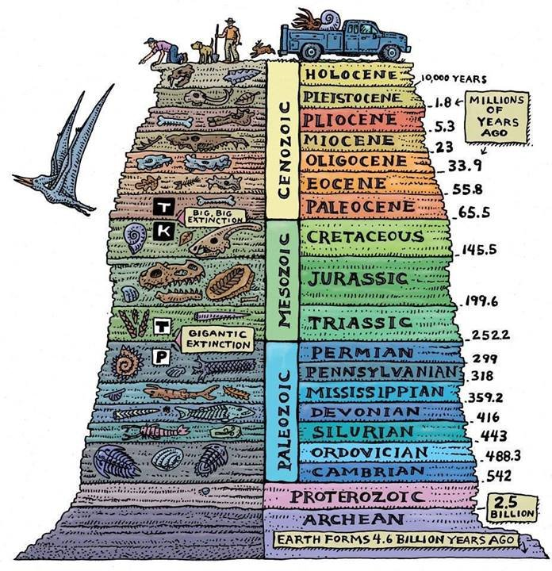

Paleontological history of Earth in one picture from an excellent Ted talk by Kenneth Lacovara: . Especially worth watching just to know how to find dinosaur bones. Apparently they are fairly easy to find!

[Discussion](https://x.com/sytelus/status/1041922870949994497)
