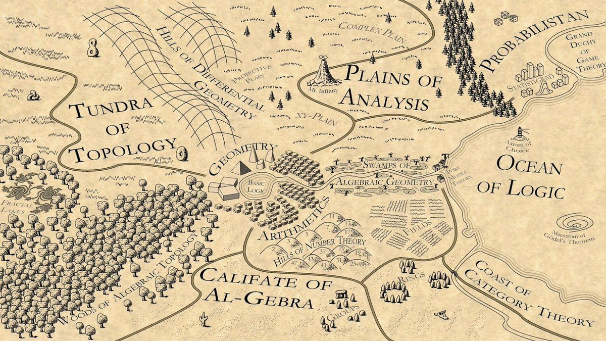

Map of Mathematical landscape created by Martin Kuppe called "Mathematistan". He placed related areas closer and put several subtle interesting attractions in this land :)

(explanation by Richard Green: <https://plus.google.com/101584889282878921052/posts/AcUBb8Y9uBj>) 

[Discussion](https://x.com/sytelus/status/1053957905420939265)
