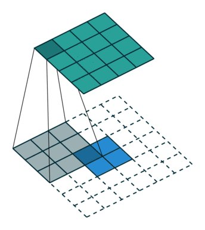

Great animations for deconvolutions (transposed convolutions) and dilated convolutions. Picture is indeed thousand words:

Convolution arithmatic: <https://github.com/vdumoulin/conv_arithmetic> … 

[Discussion](https://x.com/sytelus/status/1056094053891104768)
