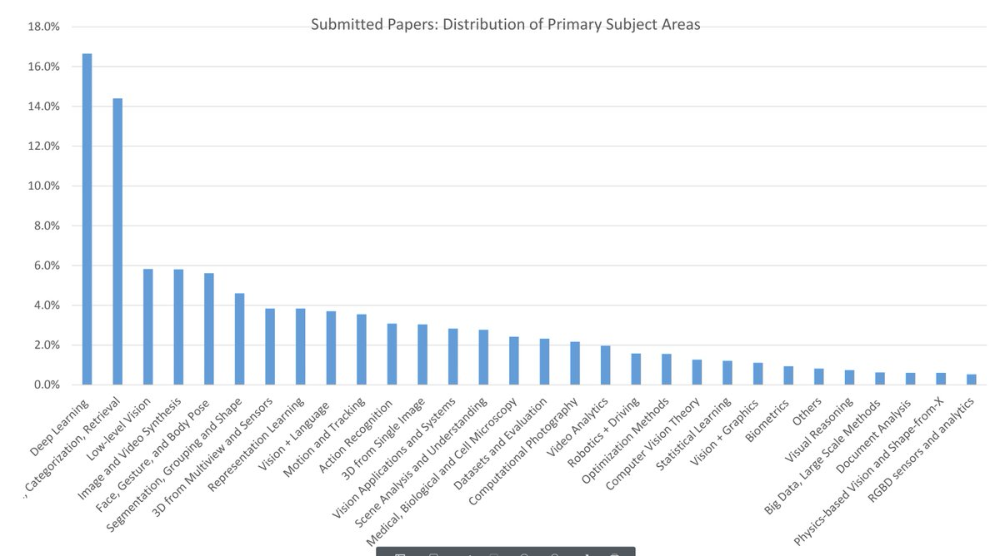

CVPR received 5131 submissions for 2019. Below are the stats. In summary, CVPR turning in to DLPR while ICML transforming in to ICRL :). 

[Discussion](https://x.com/sytelus/status/1066654511819681792)
