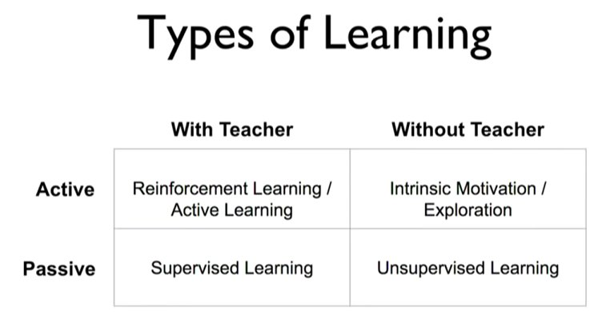

Categorization of ML methods in to supervised, unsupervised and RL always had that annoying lack of symmetry. Recently Alex Graves put out this better way of classifying ML methods: 

[Discussion](https://x.com/sytelus/status/1073786869492592640)
