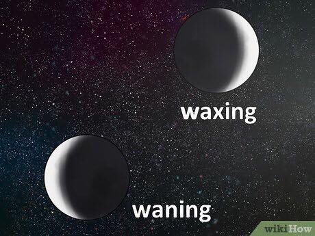

You can tell whether moon is growing or diminishing (waxing or waning) by looking at which side of moon is illuminated. Right side means moon will be progressively more illuminated and left means opposite. 

[Discussion](https://x.com/sytelus/status/1084769126369746944)
