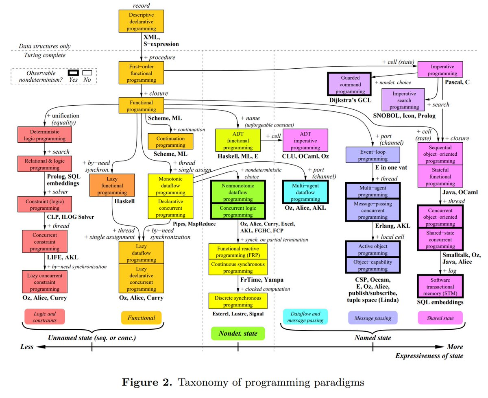

Map of programming paradigms from the paper <http://hiperc.buffalostate.edu/courses/ACM612-F15/uploads/ACM612/VanRoy-Programming.pdf> 

[Discussion](https://x.com/sytelus/status/1089089778144882689)
