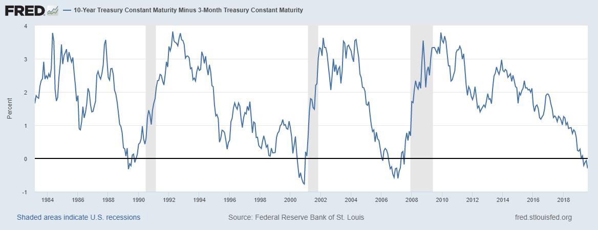

I haven't seen more stronger predictor of recession than T10Y3M metric. The gradual downturn and dips in this graph could not have been more precise!

<https://fred.stlouisfed.org/graph/?g=oAB9> 

[Discussion](https://x.com/sytelus/status/1159390862670888960)
