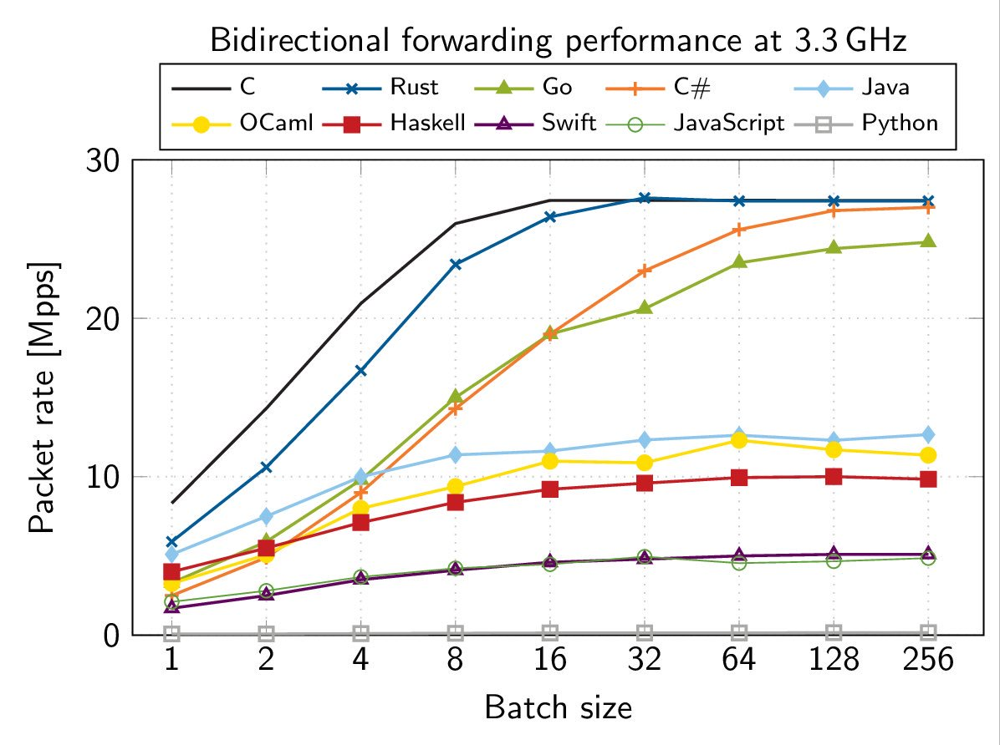

How does programming languages perform when writing a user mode network driver? This is not perf test but no wonder C still rules the roost and Python goes down in. Surprising to see Rust not matching up, Swift left in dust  while Go bit behind C#. 
<https://github.com/ixy-languages/ixy-languages> 

[Discussion](https://x.com/sytelus/status/1172393058656088065)
