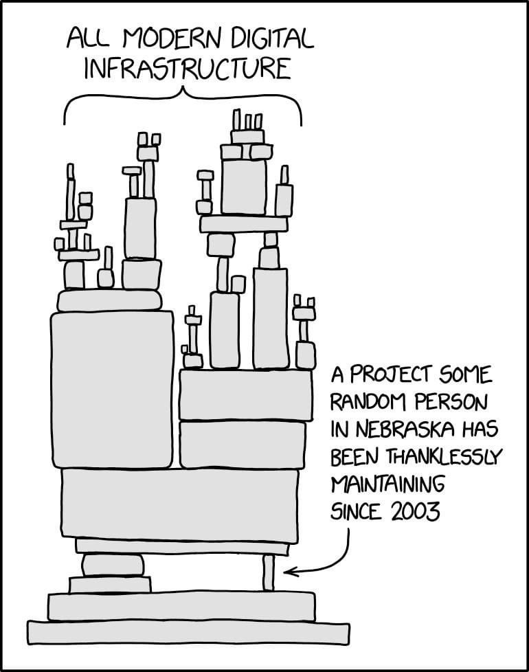

If you go through full dependency tree of any significantly sized project, you will be surprised how many deep nodes are maintained by single unknown unpaid person whose build machine is personal laptop one step away from getting hacked. 

[Discussion](https://x.com/sytelus/status/1375618929297518594)
