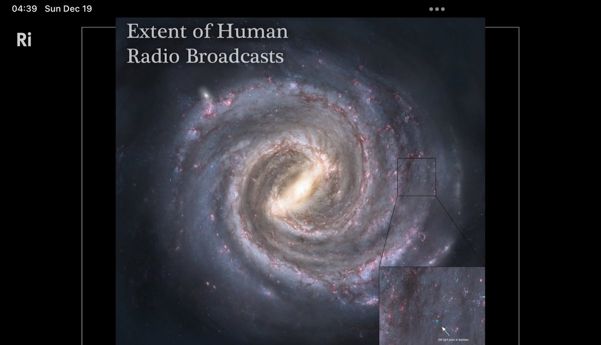

Airocebo is the largest radio telescope we have built. If there was airocebo on Alpha centuri, it would not be able to detect regular radio transmissions from earth. If you use aerocebo as transmitter and receiver, max range is just 400 light years! 

[Discussion](https://x.com/sytelus/status/1472547895333187585)
