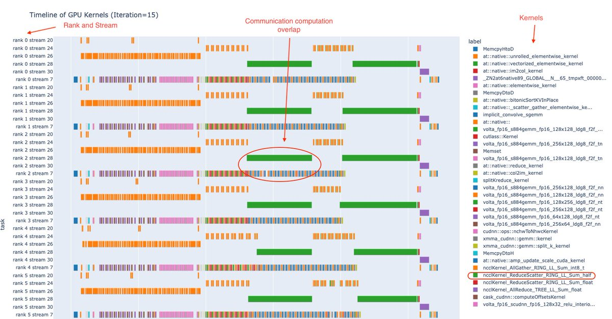

PyTorch released Holistic Trace Analysis library last week that can tell you about:

- Time in compute vs communication vs memory events

- Find kernels with longest durations

- Is there an overlap between compute and communication (why my GPU idle)?

<https://pytorch.org/blog/trace-analysis-for-masses> 

[Discussion](https://x.com/sytelus/status/1616243338247823360)
