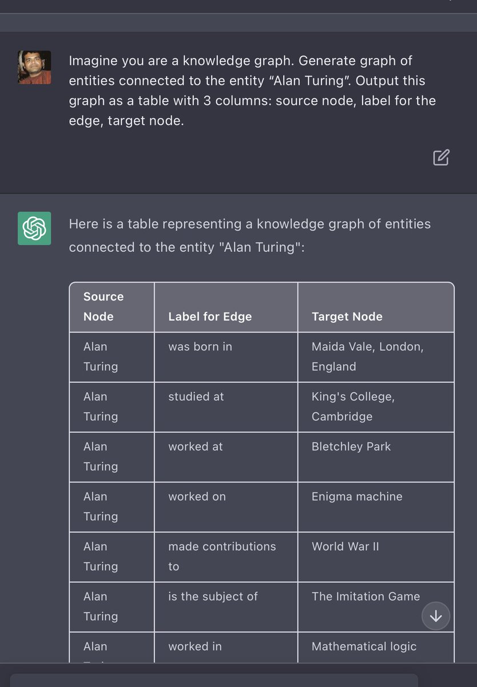

Looks like you can extract the knowledge graph from LLMs simply by asking! If you can do tons of queries, you can dump whole knowledge graph from LLMs, do consistency checks, ranking and a lot of fun things with graphs. 

[Discussion](https://x.com/sytelus/status/1623952193312403457)
