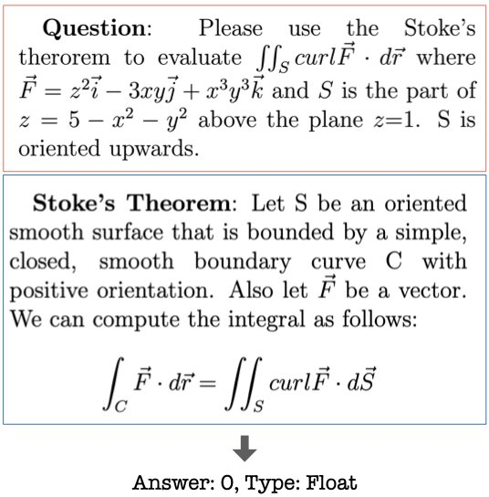

How does the model do on a new unseen out-of-distribution benchmark is a core distinguishing feature towards AGI and a fundamental differentiator from classical ML where we only cared about fixed set of specific benchmarks or in-distribution test sets. The new work, TheoremQA,… <https://x.com/WenhuChen/status/1710827254408679807> 

[Discussion](https://x.com/sytelus/status/1711524957556216028)
