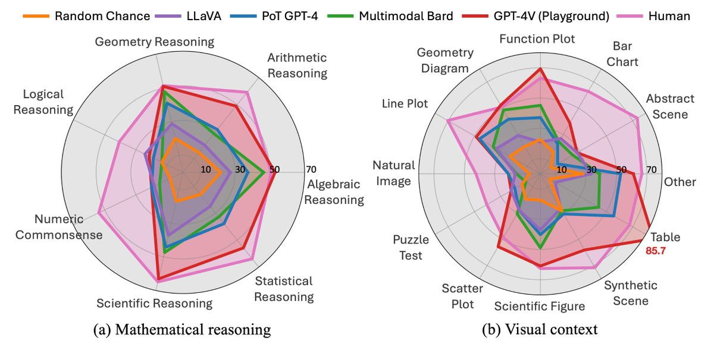

The new benchmark, MathVista, looks *amazing*! It's ~6k diverse examples nicely categorized for measuring visual mathematical reasoning.

Best part? It comes with human baseline!

Punch line: GPT-4V has huge gap with humans.

MathVista is a great separator between models! <https://x.com/lupantech/status/1714060074396913699>

[Discussion](https://x.com/sytelus/status/1714557767250489783)
