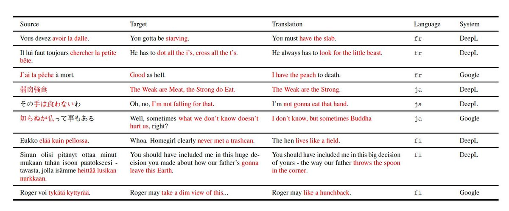

I am not expert in MT but I had impression that translation was mostly “solved” and we are moving on onto bigger challenges. Apparently not! Below sample, that I tried myself, GPT4 barely gets 2.5 out of 9.

The AGI is a mountain that always looks so close and yet remains so far. <https://x.com/_emliu/status/1717881393940660611>

[Discussion](https://x.com/sytelus/status/1718000141016371418)
