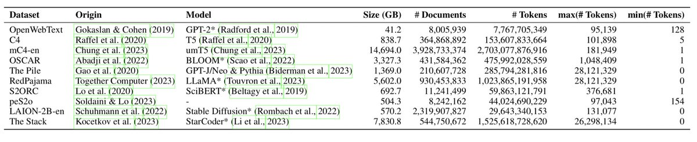

WIMBD is open source toolset to detect duplicates and contamination level with several benchmarks.

The cool thing is that it works on a single (but beefy) node.

It performs total of 16 analysis on your big data. Looks very useful! <https://x.com/yanaiela/status/1719755578409619740> 

[Discussion](https://x.com/sytelus/status/1720624175822369093)
