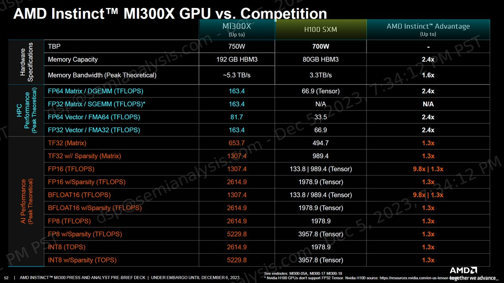

AMD has huge shot at flipping the market in 2024. MI300X has 32% more tflops than H100 for BF16 (1307 vs 989)! Who doesn't want 20% more usable flops for the lower or even same price 😍. Image credit: [@dylan522p](https://x.com/dylan522p)

Meanwhile TPUv5p is an interesting design with BF16 tflops of 459… 

[Discussion](https://x.com/sytelus/status/1738172333410717930)
