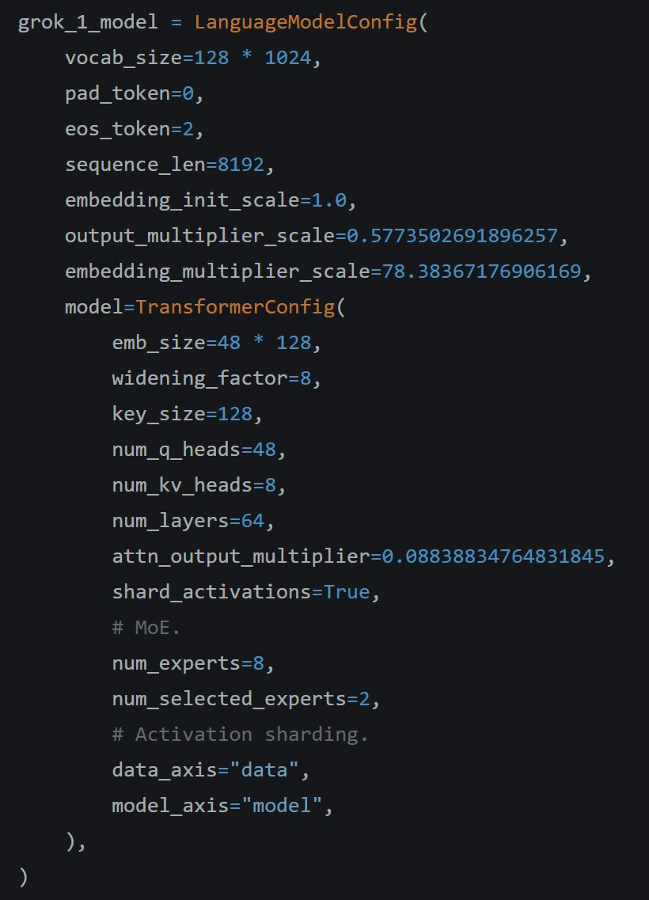

Grok-1 code is released. It's 8 experts, 2 selected at a time. Trend of large vocab (131k) continues. Attention output multiplier is interesting. Overall, it's much large model than I'd thought so bit surprised about lag in perf than other models. <https://x.com/ibab/status/1769447989192675748> 

[Discussion](https://x.com/sytelus/status/1769458277308571676)
