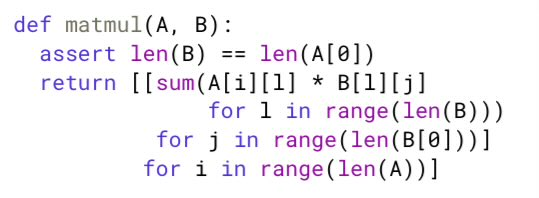

How many flops below matmul would use on i9 CPU?

Just 0.042 gigaflops! 

Your CPU has 20000X more flops though. So, how do you matmul  and drive flops truly to its limits? 

This fantastic article by Justine shows how (and she even beats Intel MLK!). <https://x.com/JustineTunney/status/1774621341473489024> 

[Discussion](https://x.com/sytelus/status/1774713616090202537)
