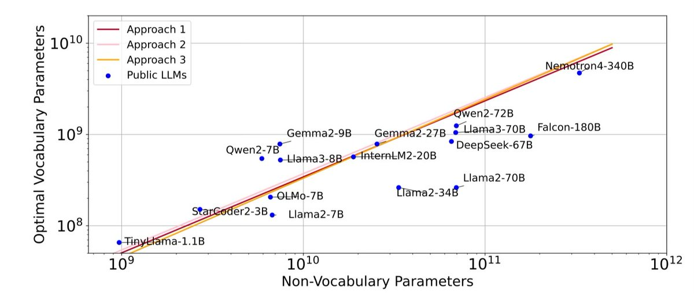

Scaling laws for vocab size: <https://arxiv.org/abs/2407.13623>

This paper asserts that as model gets larger, vocab size should be getting larger. Specifically, Llama2-70B vocab size is way below optimal (32K vs 216K).

However, E2E benchmark perf improvement seems underwhelming even… 

[Discussion](https://x.com/sytelus/status/1841047571122569502)
