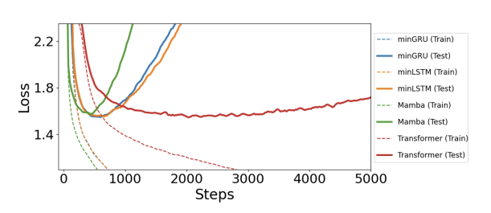

There is something about transformer architecture whereby even a ton of overtraining doesn't cause significant overfitting. 

No other architecture features this property. Most ML folks had assumed that was simply not possible.

Source: <https://arxiv.org/abs/2410.01201> 

[Discussion](https://x.com/sytelus/status/1841960777588379656)
