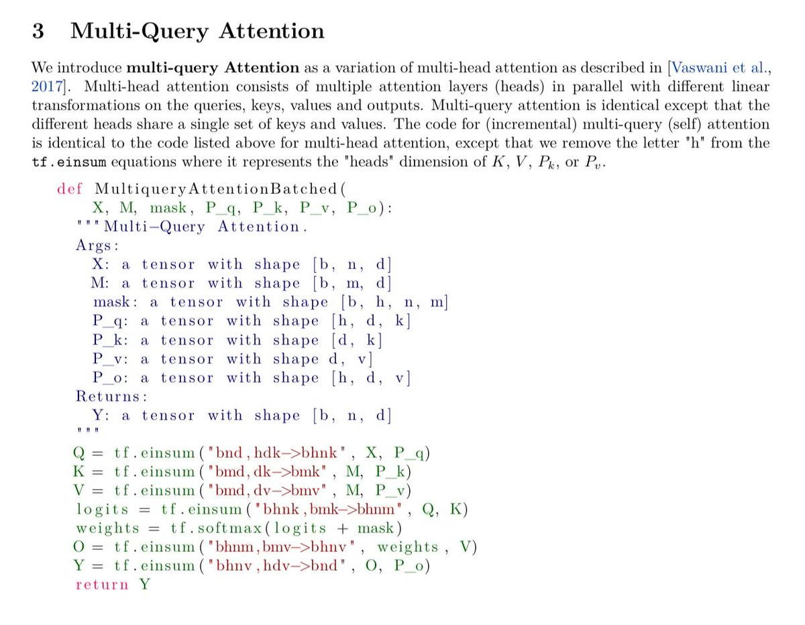

Single author Noam Shazeer papers are thing of beauty. No hesitation for putting literal code in the paper instead of math.

And he will liberally explain you his precise thought process instead of trying to impress you with a magic trick of pulling out a rabbit. <https://x.com/iScienceLuvr/status/1848543458106974478>

[Discussion](https://x.com/sytelus/status/1848836276725944586)
