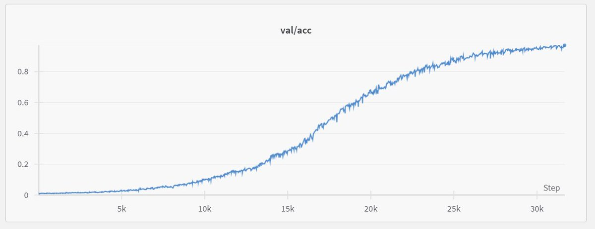

I think this can serve as good interview question ;)

You measure loss and accuracy over some validation set:

And you end up with plots like below. What's going on?

[Discussion](https://x.com/sytelus/status/1850375646373196113)
