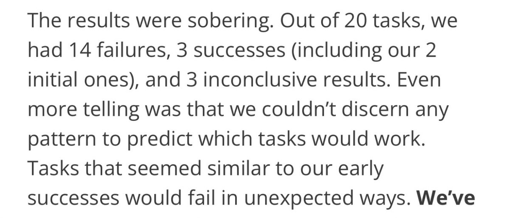

For real-world use case, Devin gets 3 out of 20 tasks done correctly. It seems models are at PhD level for certain tasks but then they fail on simpler stuff where “Junior SWE” would have done a flawless job. <https://x.com/HamelHusain/status/1880129024737104118> 

[Discussion](https://x.com/sytelus/status/1880160423108112721)
