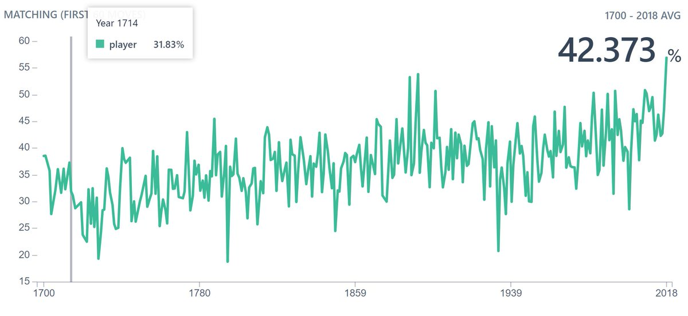



Graph might be bit misleading. If you turn of smoothing, below is what you see. We can see several peaks and valleys throughout but lately it had many more spikes possibly causing up trend. Also notice the absolute value differences. 

[Discussion](https://x.com/sytelus/status/1095930354093805573)
