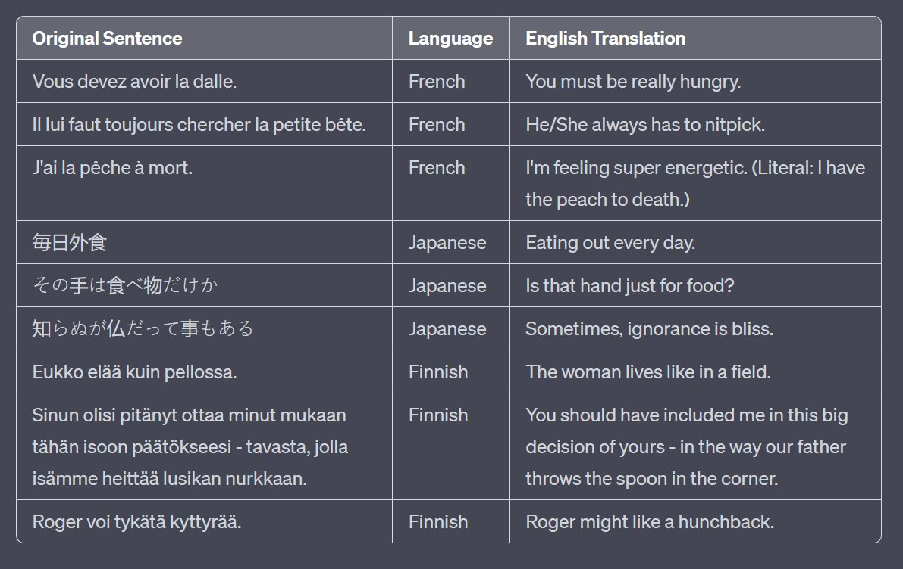



[@SebastienBubeck](https://x.com/SebastienBubeck) Responses I got from copy-pasting source image directly and asking GPT-4 to make the table :) 

[Discussion](https://x.com/sytelus/status/1718011295621149024)
