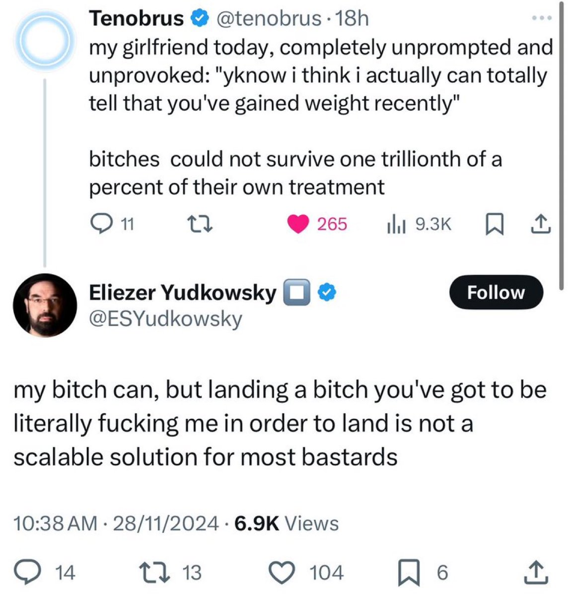



[@agi2025](https://x.com/agi2025) [@ai_for_success](https://x.com/ai_for_success) Here’s interesting conversation between humans (screenshot is not mine). About half of the humans in related thread write that they don’t understand this conversation. When I paste this image in GPT-4o with simplest prompt “Explain this conversation”, it seems to get intricacies… 

[Discussion](https://x.com/sytelus/status/1862322541739876758)
