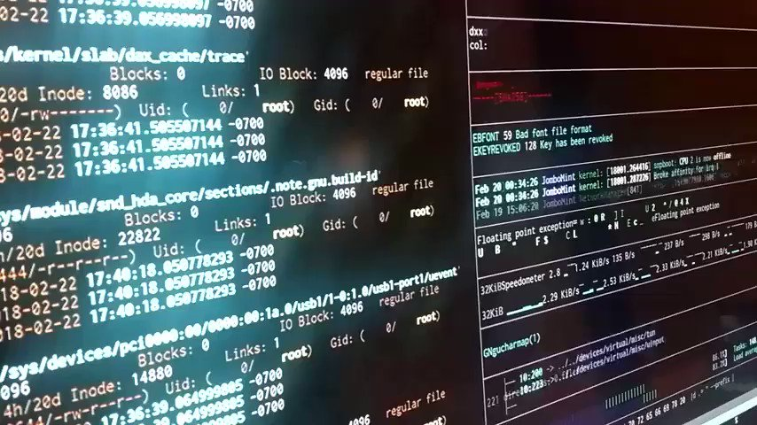

RT [@randal_olson](https://x.com/randal_olson): Expectations vs. reality in computer #programming.

<https://www.reddit.com/r/ProgrammerHumor/comments/87i5za/expectation_vs_reality/> 

[Discussion](https://x.com/sytelus/status/978908565716037632)
