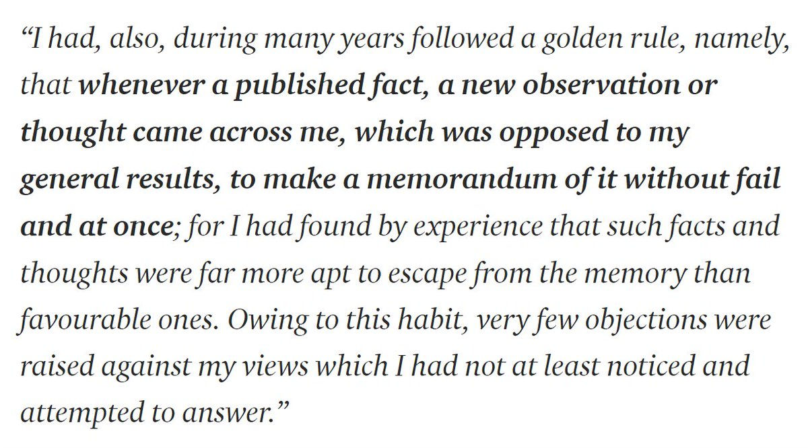

RT [@SteveStuWill](https://x.com/SteveStuWill): Darwin on his strategy for overcoming confirmation bias. <https://medium.com/@christianq010/8-mental-habits-from-charles-darwin-that-made-him-one-of-the-greatest-thinkers-of-all-time-4bdc5ae0a8fb> 

[Discussion](https://x.com/sytelus/status/1340177836628275201)
