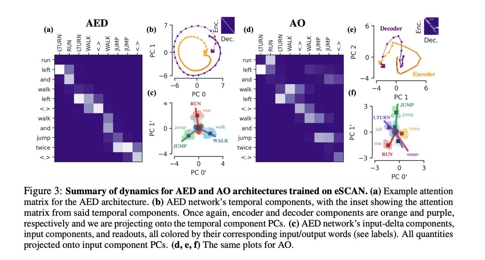

RT [@ak92501](https://x.com/ak92501): Understanding How Encoder-Decoder Architectures Attend
abs: <https://arxiv.org/abs/2110.15253> 

[Discussion](https://x.com/sytelus/status/1454730745805561858)
