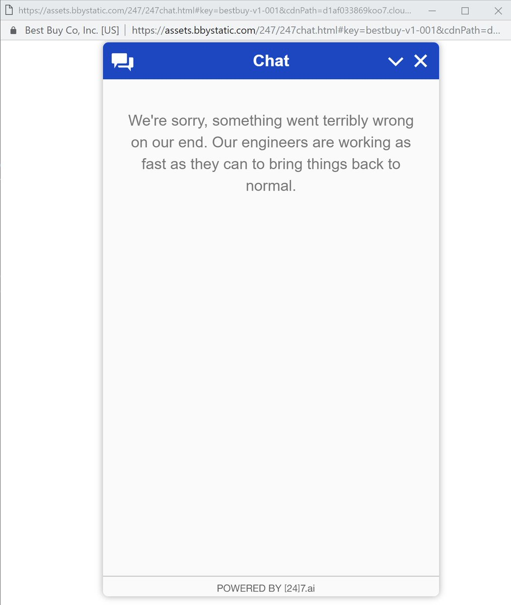

This "AI" is supposed to redefine my customer experience. I tried this in night and got error that they are available only during working hours. I'm trying last one hour and below is what you get. Redefinition apparently is 24x7 non-existent customer support. [@bestbuy](https://x.com/bestbuy) [@24_7_inc](https://x.com/24_7_inc) 

Hint to people working in customer support business: Never leave your customers in cold water. If your system failed then give them a way out, perhaps show a phone number they can call or email they can send.

[Discussion](https://x.com/sytelus/status/1085689098516389888)
