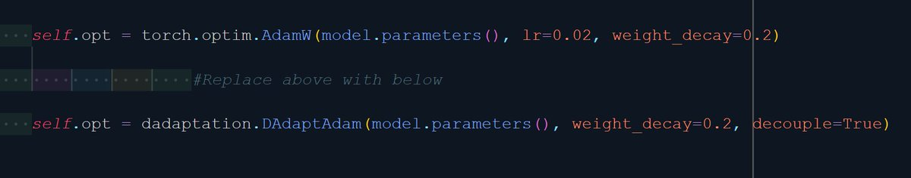

One of the important long standing issues in deep learning is hyper param tuning, especially LR and weight decay. When you are trying out various model archs, params count and batch sizes, things quickly go out of hand. But now there is a definitive answer at least in part! 🧵

I have came across dozen or so papers on tuning-free optimizers. If you want ever want to experience an area of research which fails miserably in practice, this is probably it. But now there is new kid on the block and you might want pay attention!

The new optimizer DAdaptAdam proposed in paper by [@aaron_defazio](https://x.com/aaron_defazio) et al, is working surprisingly well: <https://github.com/facebookresearch/dadaptation>
Authors tried it on different archs including transformers and matched perf to manually tuned LR. And it is  simple to use: 

The real torture test for such algos is the cifar10 super convergence bench. The gold standard is laboriously found OneCycleLR schedule that yield 94% acc in just 10 epochs under 10 sec! If you use tuned AdamW, you get around 89.5%. DAdaptAdam gets 92% in my testing, best so far.

DAdaptAdam + siblings (including DAdaptAdan in latest PR) are still not fully tuning-free. You still must tune weight decay manually. There is no real weight decay schedule either. I also had trouble in FP16 model. We still have 99 problems but tunning LR likely isn't the one :).

[Discussion](https://x.com/sytelus/status/1625696086693388288)
