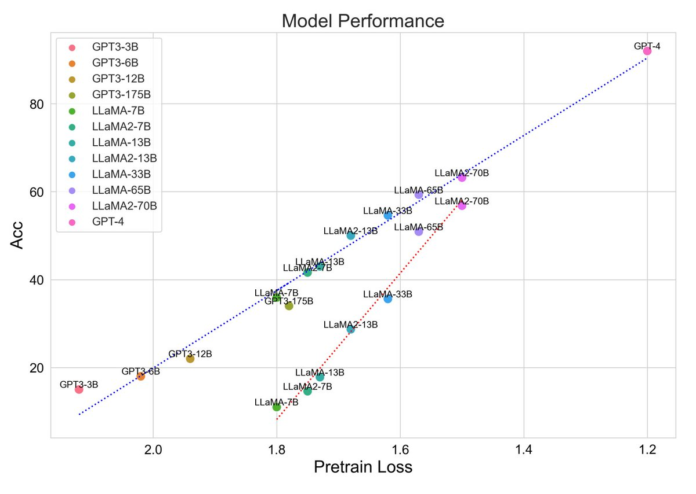

Tweet review of this interesting paper: 

Scaling Relationship on Learning Mathematical Reasoning with Large Language Models

<https://arxiv.org/abs/2308.01825>

The main achievement here is pushing LLAMA-1's GSM8K score from 11.0% to 49.3%. 🧵

So, first let's get this out of the way: technique is dead simple but some of the observations on the way are much more interesting. If you finetune LLAMA1 on GSM8K's training data, you already get jump from from 11.0% to 35.9%. No big deal.

To go from 35.9% to 49.3%, authors simply sample k=100 responses from the model, reject any responses that can be verified as wrong (ex, run Python code) and are duplicates. That leaves only handful (may be ~5). You add these in your finetuning dataset, and voila, another jump!

This is dubbed as "RFT" but this has been done before and not a lot of surprises here. Authors did missed opportunity for not measuring degradation on other benchmarks for LLAMA1 as this would have been much more interesting. But all that is besides the point.

What I really liked is this plot in the paper. You can stare it for quite a bit to take it all in! 

There is so much to say about this but let me lay out the main points that authors observed and some of mine:

First, the pretraining loss seems to comparable among all these LLMs! These models are trained with  different datasets but still they all fall in line quite nicely.

This may be because sampling whole internet may be has more or less same distribution. Also, note that the impact of lowering loss is exponential so reducing loss from 1.5 to 1.2 may not seem like a big deal, it is a big deal. This is again not completely new observation.

Another observation is that larger model benefits less from SFT compared to ICL. This again goes on to indicate that ICL is emergent with only with size. Interestingly, for large enough models, ICL benefits more than finetuning!! And that crossover point is likely closer to 70B.

So, size is not the everything *but* as size does go up, emergent abilities rapidly become more powerful. Other knobs we have such as training for longer are log-linear but impact of emergent abilities seems to be exponential!! Remember x-axis above is log scale.

The most pressing question of our times is therefore:

Can emergent abilities of large models arise in smaller models?

It seems that these abilities are far more important and powerful and something that we should obsess much more about.

[Discussion](https://x.com/sytelus/status/1687975809229918208)
