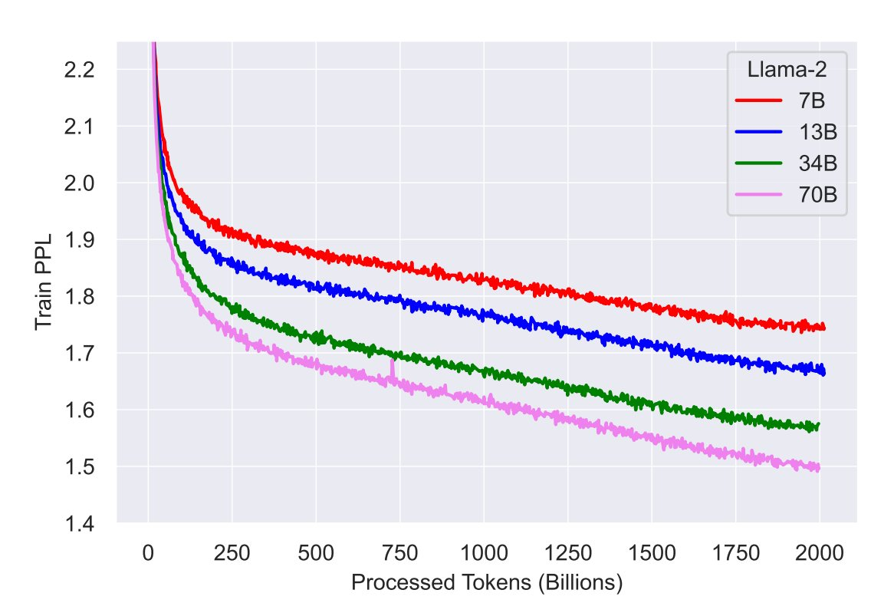
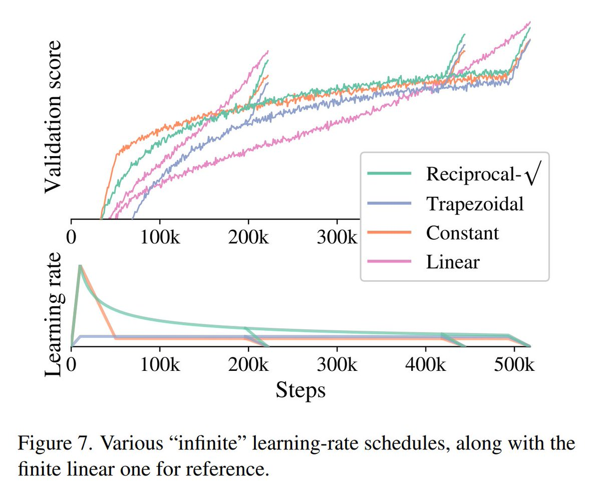

Just learned something very cool about LR schedules. This one is so huge it surprises me that it's not in its own paper but rather tucked away.

Problem: Most training use cosine/linear decays but this requires specifying number of steps in advance. This is quite troublesome.  🧵 <https://x.com/sherjilozair/status/1687837844729966592>

For example, LLAMA2 trains for 500k steps but when you look at training curves, it is obvious that you could have kept going except that now you can't because it's too late. Repeating entire run with new larger steps is too expensive. 

Wouldn't it be nice if you can keep training infinitely? You can take checkpoints when you like and see if that's good time to stop.

Or may be when you get new data, you just continue training. 

This would be huge. In current era of super expensive runs, it would be huge huge!

It turns out it is actually possible but not a lot of practitioners know about it. 

Instead of cosine decay, you do this:

1. Do usual warmup for steps w.
2. Decay LR as max_lr * sqrt(w/step).
3. Before taking a checkpoint for eval do cool down procedure as described next.

So, let's say you want to see results at 200k steps. First, take a checkpoint at 200k. This is where you can restart the training if you like. However, before evaluating the model, do the cool down for c steps where you linearly decay LR to 0 and then get final checkpoint.

After cool down, the model would have *approximately* same perf as if you did cosine decay. If you don't do cool down, model will significantly lag behind cosine decay equivalent! 

Now you can also continue training further after 200k steps using checkpoint you had saved.

So that's rather long winded explanation of Section 3.5 of this paper: <https://arxiv.org/abs/2106.04560>. But this is such a big deal, someone had to lay it out. 

Full credit goes to [@__kolesnikov__](https://x.com/__kolesnikov__) for pointing out this little gem which I strongly feel should be its own paper.

If you ask how good is this scheme compared to usual LR schedule, here is the plot from the paper. Notice that it each instance rsqrt is very close to linear decay. Even constant gets quite close! But all the magic seems to be in cool down when val score suddenly starts rising: 

Bonus: While digging into this topic, I came across another LR schedule called NoamLR. I would leave you to find it and appreciate it by yourself :).

[Discussion](https://x.com/sytelus/status/1688119658266890240)
