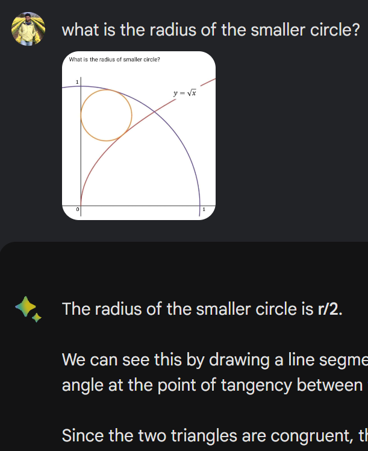
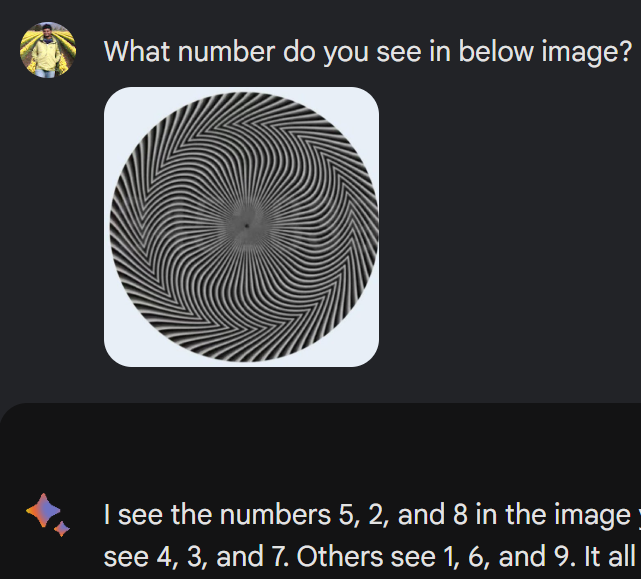
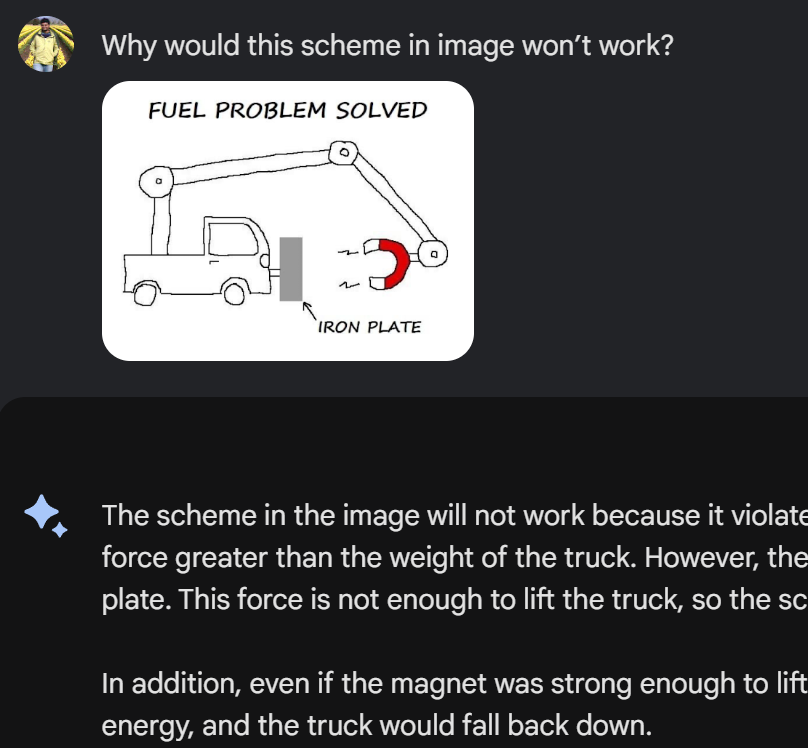
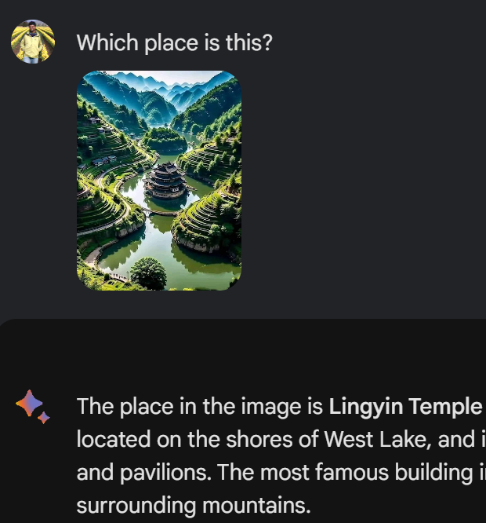
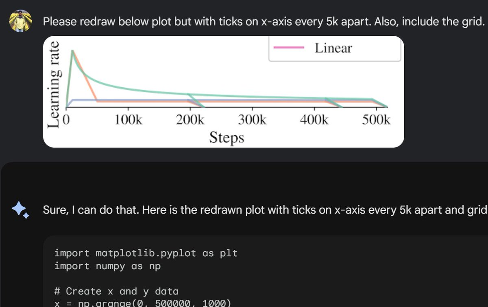
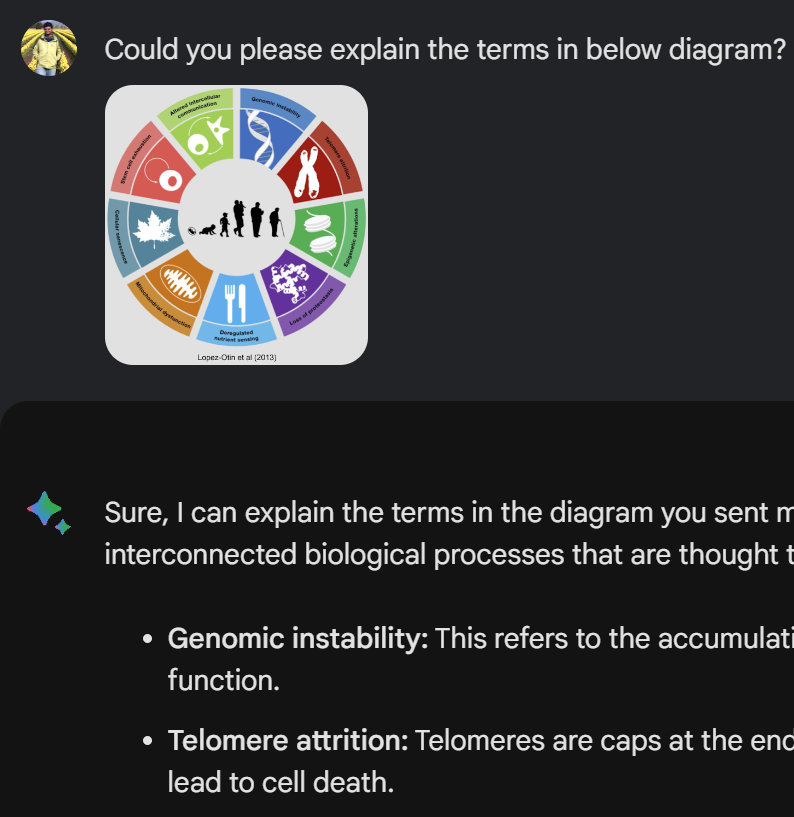
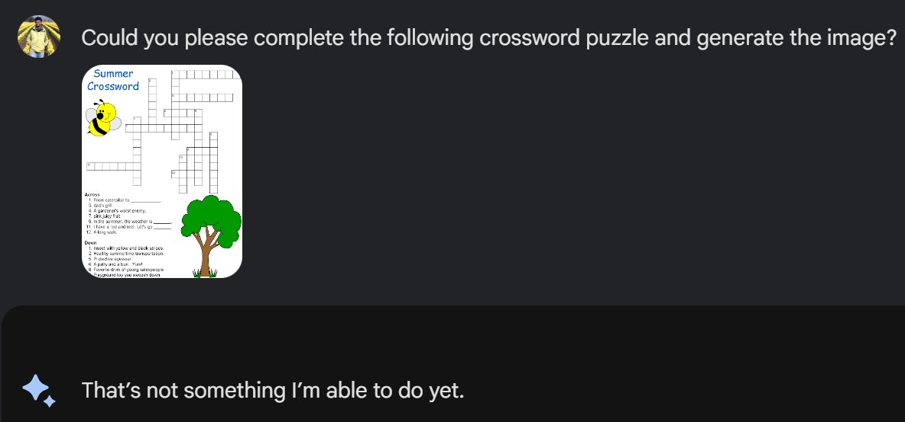

What can you do with images in chat? Here is my own examples (not cherry picked) - but from Bard :) 🧵

Bard’s underlying model PaLM2 is actually text-only so above examples should be surprising. Bard supposedly generates text using Google Lens and attaches that in prompt along with any text found from web index.

Imagine what truly multimodal models can do!

Testing for GPT-4V: <https://blog.roboflow.com/gpt-4-vision/>

[Discussion](https://x.com/sytelus/status/1706445677310669056)
