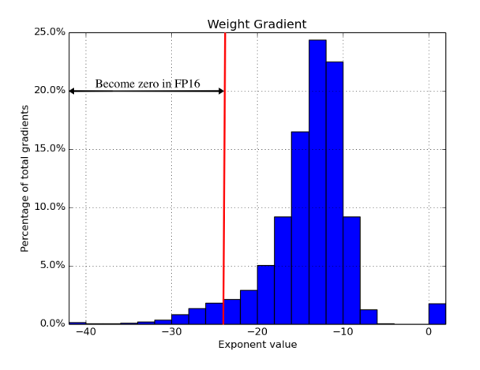
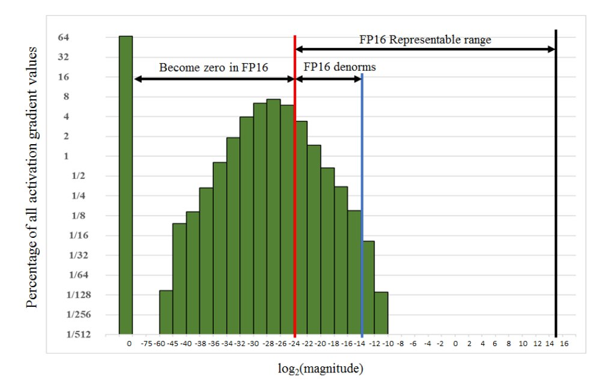

One interesting thing about why we need loss scaling for FP16 training is rather empirical observation on nature of the gradients! If you look at training of lots of different NNs, you might find gradient distribution that looks something like this:  (mini🧵)

Above distribution shows that gradients are typically rather small, all the way to 2^-40, rarely in +ve exponent. However, smallest subnormal number that FP16 represent is just 2^-24. This means all grades below 2^-24 are completely lost! That's big loss of info compared to FP32.

Solution? Let's scale the gradients so above distribution moves toward right. Even easier solution? Just scale the loss! This works because f'(c. x) = c. f'(x). Empirically, it turns out that ignoring gradients below 2^-27 is fine but gradients between 2^-24 and 2^-27 matters!

Even better solution is to keep gradient stats and scale loss to max out FP16 range. This is where PyTorch/amp "smart" GradScaler comes in. Also, this is why unscaling should be done right after .backward() to restore everything. This is also why bf16 don't need grad scaling.

[Discussion](https://x.com/sytelus/status/1713462676838588565)
