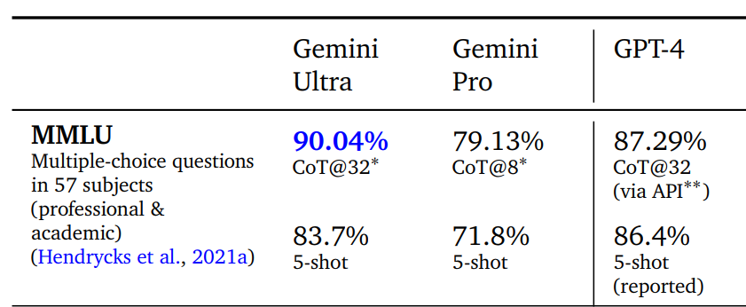

Gemini does win against GPT-4 with CoT@32 but not on 5-shot. This likely indicates that Gemini is inherently more powerful but somehow without proper prompting that capability doesn't get exposed. May be GPT-4 still has better IFT? Still, this is super exciting milestone! 

This is the first time any model can claim to be matching human-expert level in wide spectrum of topics. Though CoT@32 is obviously inelegant, one way to think about of them is ensembles which a band-aid we need in current scheme of things given we don't have planning.

[Discussion](https://x.com/sytelus/status/1732529808486383741)
