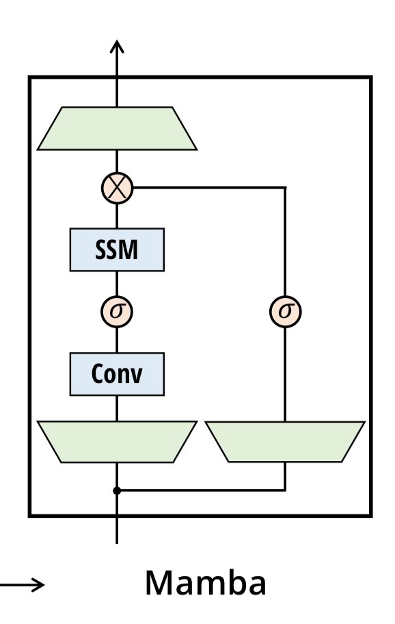
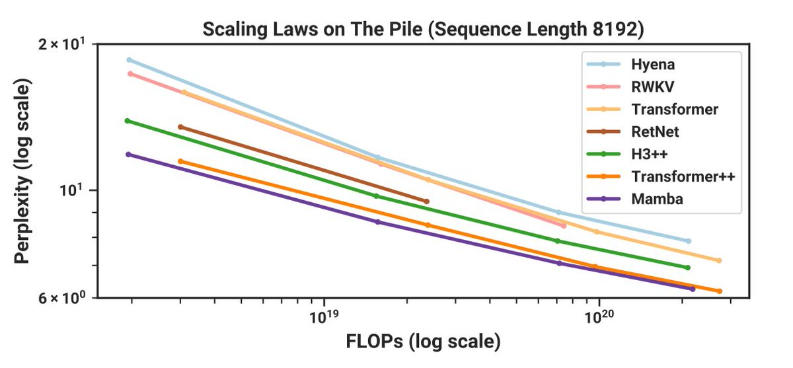

I think we haven’t fully grasped the impact of Mamba paper that was just dropped this week. From the results so far, it is very likely that Mamba might just be the architecture that finally unseats the attention from its long held grip on the throne.🧵 

So far, state space models were largely academic curiosity. Sure, results were great in Long Range Arena but things sucked in language modeling for regular context lengths. More importantly, Flash Attention basically steam rolled all sub-quadratic attention cottage industry.

SSMs required whole box of complicated tools but all we really have is just accelerated matmul. How can you turn everything into nail when you just have a hammer?

Enter [@tri_dao](https://x.com/tri_dao) and [@_albertgu](https://x.com/_albertgu) . They have managed to accomplish something that was illusive and seemingly impossible: hardware accelerated input-dependent selection! This finally allows for capabilities that attention provides but on a compressed finite state!

Mamba architecture has inherent beauty. There is no more attention bad-aided with FFN without explanation. Instead there is just one uniform block that repeats with an architecture that has mathematical backing. The compute *and* memory scales linearly to the sequence length.

Training and inference is much faster. No more ugly caching hacks. A lot of papers have claimed linear time attention replacement but none have confirmed it with as extensive experiments as Mamba or have been as performant and eventually haven’t stood the test of time. 

Mamba beats Llama, RetNet and RWKV flops for flop but there are still few unknowns. Paper has experiments only upto 3B scale. I didn’t like the comparisons in paper with rather weak baselines like OPT and Pythia. We don’t know if the selection mechanism  performs well everywhere.… [continue reading](https://x.com/sytelus/status/1733467258469724467)
