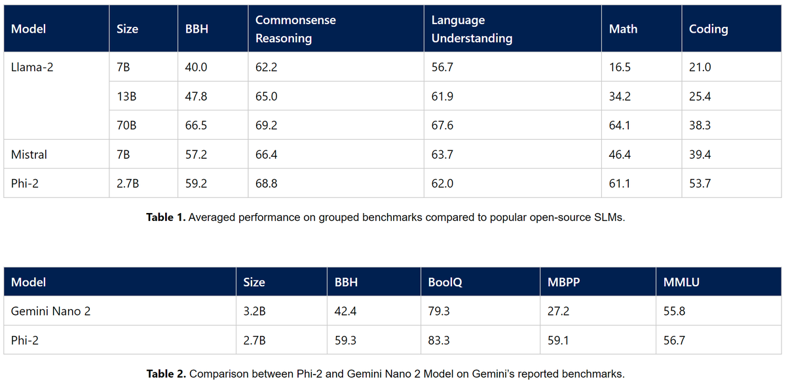

Mistral-7B is cool but you know what's cooler? A more powerful model in just 1/3rd of the size!

Welcome to Phi-2.

This is something our team at Microsoft Research had been tirelessly working on and now we have more numbers comparing with Llama-7B, 13B, 70B and Gemini Nano. 👇

Phi-2 is best in the class model beating models 3X of it's size and in many cases even much much larger. Phi-2 especially shines in Math and Coding:

Want to give Phi-2 a try? Here is how:

1. Go to <http://portal.azure.com>, create an account if you don't have one

2. Go here: <http://aka.ms/phi2az>

Our Phi-2 efforts proves that we had been wasting enormous amount of compute on rather ineffective training data. Throwing a kitchen sink at model has a big price tag and lower quality.

More examples and discussions:  <https://x.com/SebastienBubeck/status/1734612826176794958>

Blog Post:  <https://microsoft.com/en-us/research/blog/phi-2-the-surprising-power-of-small-language-models/>

By popular demand, Phi-2 is now directly available on Hugging Face!!

<https://x.com/SebastienBubeck/status/1735050282210615431>

[Discussion](https://x.com/sytelus/status/1734881560271454525)
