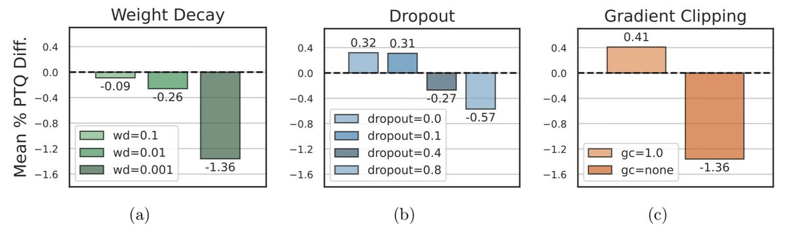

One surprising phenomenon for LLMs has been the large activation outliers in certain dimensions which made quantization hard but were believed to be correlated with emergent properties.

Well, this paper points out that they might in fact artifacts of training choices!

Meanwhile, if you are practitioner, the takeaway message seems to be: use bf16, weight_decay = 0.1, dropout=0, grad_clip=1 if you want your model to be more quantization friendly.

  <https://arxiv.org/abs/2305.19268>

[Discussion](https://x.com/sytelus/status/1739243496916349209)
