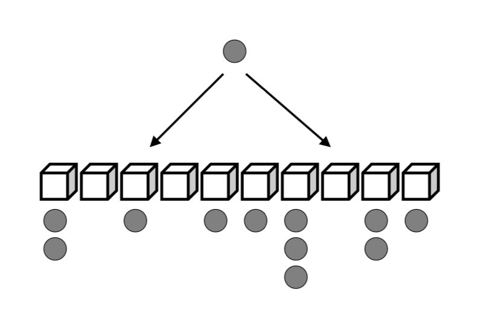

Uniform random sampling often causes hidden issue. For example, we may choose k tokens starting at random index to add in a batch. Or choose a server at random to load balance incoming requests.

But what’s the issue?

Random sampling can be modeled as packing balls in bins. 🧵

The problem here is that some bins invariably will end up with more balls while others might end up even empty. In fact, the “max load” here is given by log n/log log n. I

s it possible to improve this without making things too complicated? It turns out we can!

This fascinating simple idea is known as “power of two choices”! <http://www.eecs.harvard.edu/~michaelm/postscripts/handbook2001.pdf>.

All you do is this: instead of choosing one thing at random, choose two things at random and decide on one or the other based on your desired criteria.

For example, when load balancing, choose two servers at random and route request to the one which has the least load at the moment. This decreases “max load” all the way to log log n.

It turns out you can apply this idea almost anywhere where you are making some random choice!

[Discussion](https://x.com/sytelus/status/1755516315044102505)
