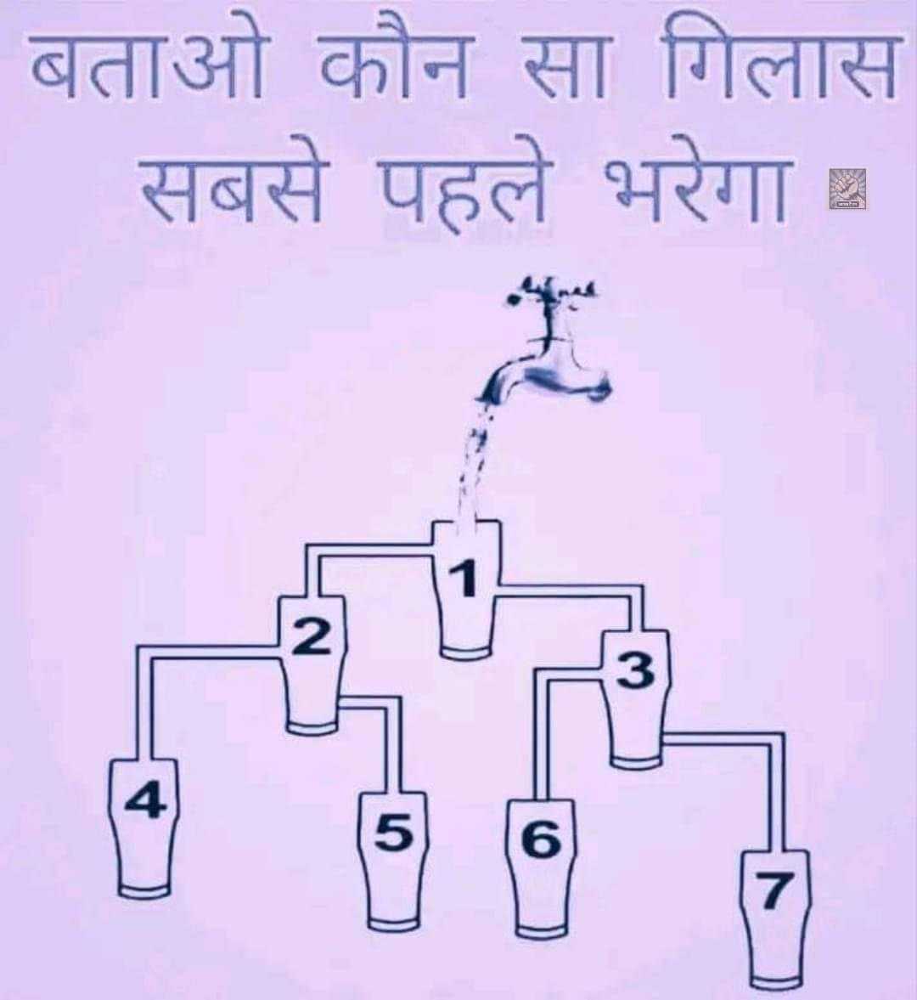

Just tried some hard prompts on Claude 3:

- Code in extinct programming language with comments in rare human language
- Geospatial/map knowledge in other countries with traffic patterns
- Complex visual puzzles

Overall, textual prompts many times does work better on Claude but…

Claude 3 is still limited because it cannot generate images or run code or search Internet. All the work OpenAI put to add bells and whistles in ChatGPT during past year is paying off right now as the competition heats up.

[Discussion](https://x.com/sytelus/status/1764849366983217300)
