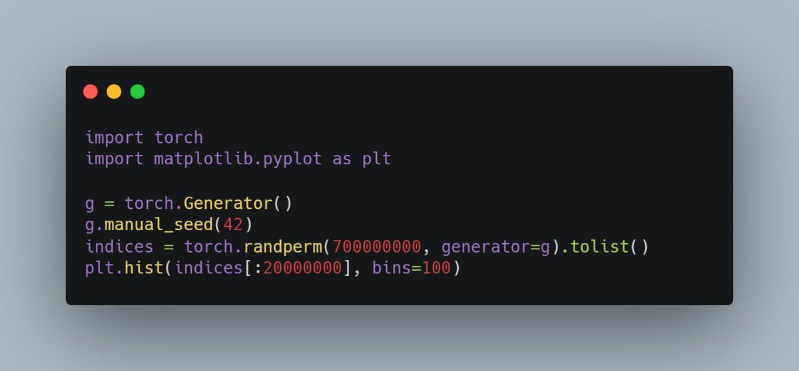
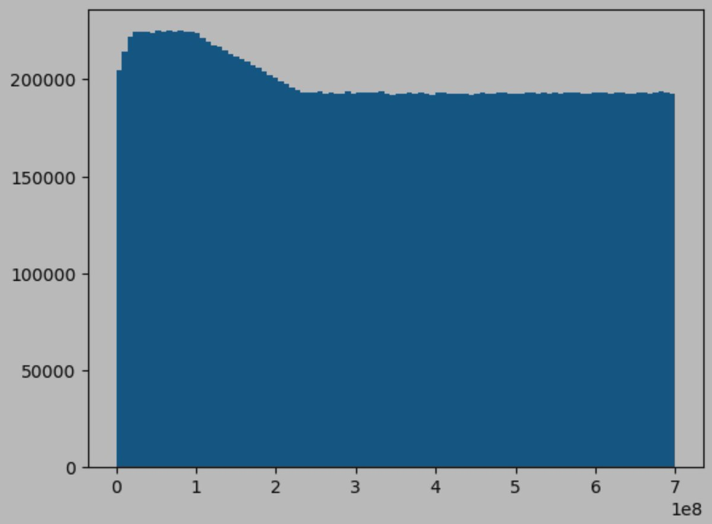

If you like a challenge, this is a very cute one. This bug was driving us crazy and finally hunted down after few hours of chase.

See if you can figure it out 😉.

The output of this code should be uniform distribution:

...but instead it looks like this stange distribution. WHY?

[Discussion](https://x.com/sytelus/status/1771090523324862552)
