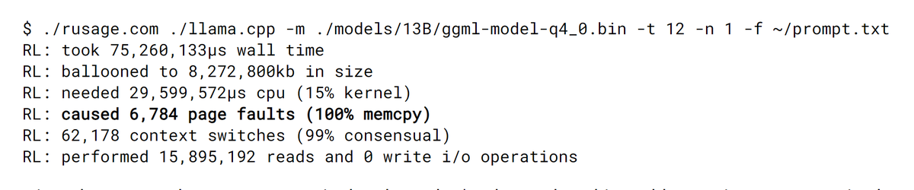

rusage is one handy tool for debugging LLMs! 

You prefix any command with it and you get memory usage, page faults, I/O info. 

For example, below shows what happens when you load model using llama.cpp. Notice page faults with 100% memcpy which means they didn't hit disk! 

Get it here: <https://justine.lol/rusage/>

[Discussion](https://x.com/sytelus/status/1772919220180779401)
