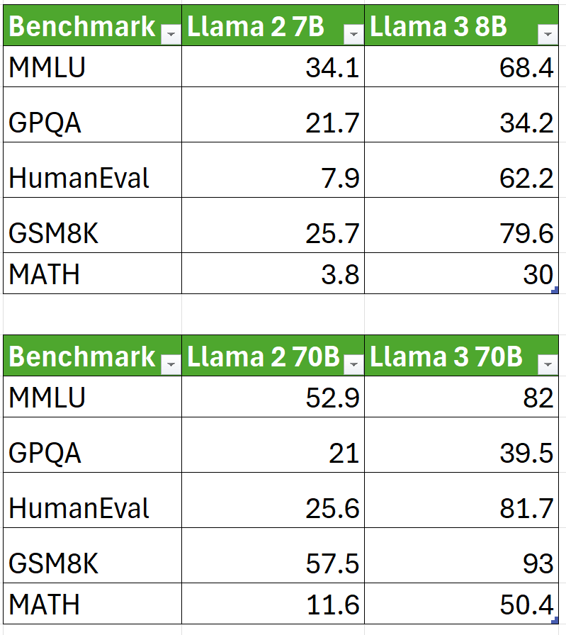
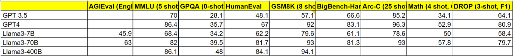

Llama3 architecture seems to have remain unchanged from Llama2 which makes it a perfect experiment for measuring performance improvement solely through data (and better tokenizer + 8k context, sure)! 

Just look at the massive bump from Llama2 -&gt; Llama3: 

Another thing to notice is how increased model size achieves better performance when data is kept constant. This is way more pronounced for Llama3 then Llama2. This scaling behavior is actually an essential indicator of better data quality: 

[Discussion](https://x.com/sytelus/status/1781222492910346479)
