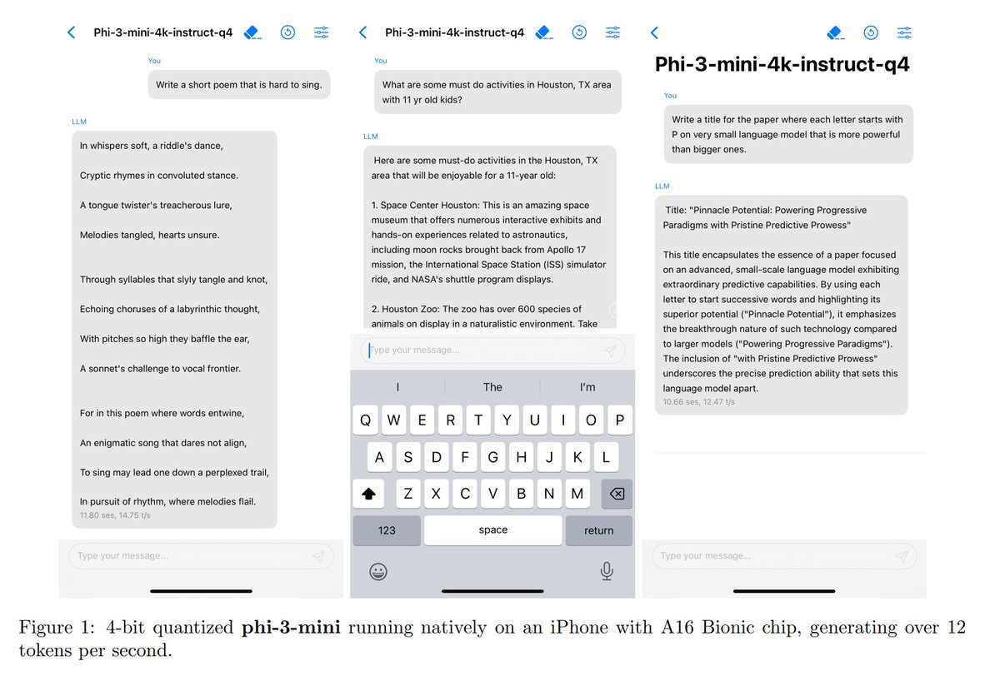
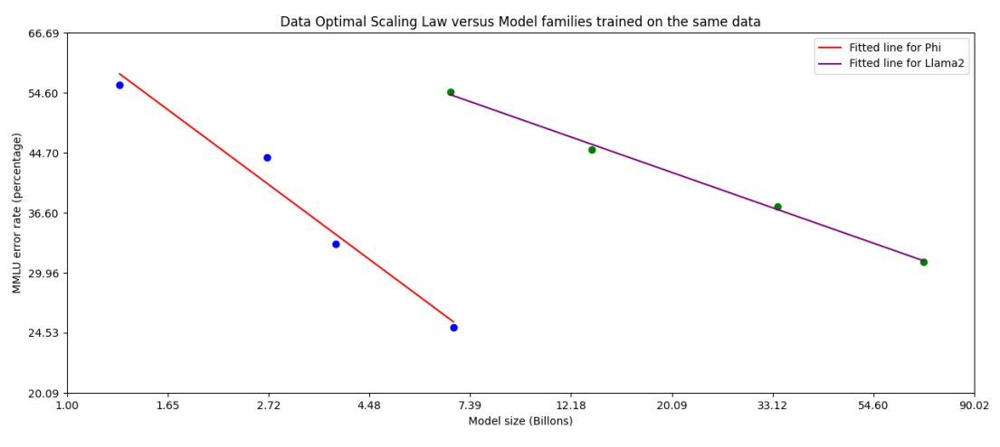
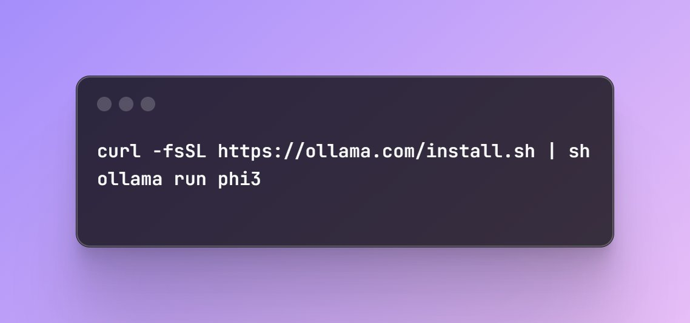

Welcome to Phi-3! 

Our team at Microsoft AI has worked hard to bring you this little wonder and it's open as in MIT Licensed!!

We started this journey almost exactly a year ago and 3 releases later now you can have ChatGPT running on your phone natively :). 🧵 

Phi-3 punches way above its weight beating way larger models! 

So, how does this magic happen? It's all in data because not all flops are created equal! Meticulous filtering and reasoning dense synthetic data can push models way beyond.

Tech Report: <https://arxiv.org/abs/2404.14219>

The most important part of our technical report is the below plot. 

Remember, we are fighting against exponentials when it comes to the scaling laws as in below log-linear plot. The primary insight here is that this line can be *tilted* and we shouldn't assume otherwise! 

This is something I'd believed in and posted just a little more than a year ago: 
<https://x.com/sytelus/status/1637407901466886144>

It's all about tilting the line!

Data turns out to be our greatest leverage so far but there are other levers, perhaps as powerful, showing up on the horizon.

Try out our models and give us the feedback!
<https://huggingface.co/collections/microsoft/phi-3-6626e15e9585a200d2d761e3>

We even have ready to use onnx and quantized gguf versions ready to go!

You can also try out phi-3 quickly using ollama running 100% locally on your machine even if you don't have GPU 😎.

Have fun! 

Here's quick demo by [@SebastienBubeck](https://x.com/SebastienBubeck) just in case you missed it:

<https://x.com/SebastienBubeck/status/1782627991874678809>

[Discussion](https://x.com/sytelus/status/1782827470686925211)
