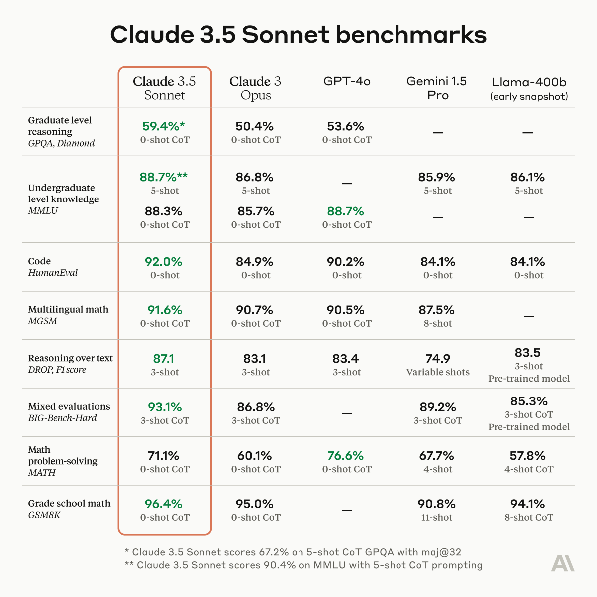

So, I have 10 diverse prompts I call "GPT4-Zero" as in GPT-4-1106 gets precisely the score of 0%.

GPT-4o gets 20% on this set.
Claude-3.5 Sonnet gets 30% on this set.

Nicely done, [@AnthropicAI](https://x.com/AnthropicAI).

Also, GSM8K is now RIP 🤯.

Claude Sonnet 3.5 is also almost 2X better at solving pull requests!!
<https://x.com/alexalbert__/status/1803804684366561651?s=46&t=NEEAGu5sd5c8nFFk6Be1LQ>

One other interesting thing is the wins for GPT-4o and Sonnet 3.5 don’t seem to overlap! If you have a hard problem, you might have better chance by trying both. I had cancelled my Claude subscription after GPT-4o came out but now it’s back on 🙂.

[Discussion](https://x.com/sytelus/status/1803970083871686809)
