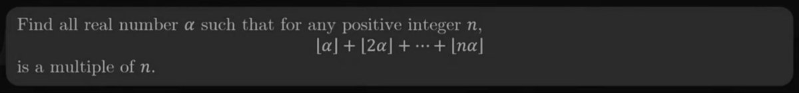

International Math Olympiad 2024 gives us good test set for frontier models :). IMO questions only need high school level math knowledge and first one is the easiest so best humans can solve it in &lt;60 mins. Here’s that question.

Any guesses how frontier models would do?

GPT 4: Failed. Pointing out incorrect cases didn’t help.

GPT 4o: Failed. Pointing out incorrect cases didn’t help.

Claude 3.5 Sonnet: Failed. Pointing out incorrect cases did helped giving right answer briefly but then continued on wrong path anyway.

So, yes, long way to go.

As benchmarks gets more and more contaminated, only the newly released test questions such as IMO, IIT-JEE etc will be the only real tests which humans also have to go through themselves.

[Discussion](https://x.com/sytelus/status/1815203516941766757)
